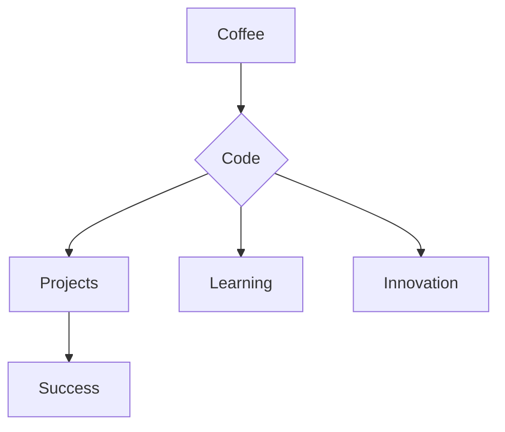
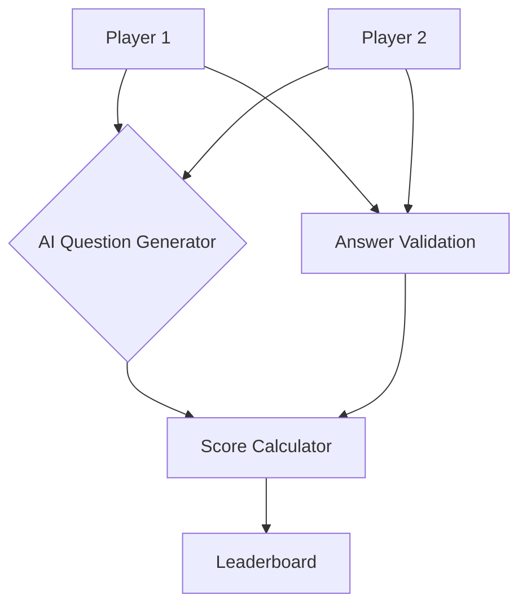

[](https://your-portfolio.com)

[](https://git.io/typing-svg)

<div align="center">
  <a href="https://x.com/MedM0D" target="_blank">
    
  </a>
  <a href="https://rahanbenabid.github.io/Resume/" target="_blank">
    
  </a>
  <a href="https://github.com/NMA19">
    
  </a>
</div>

```diff
+ Recent Computer Science Graduate 🎓 
! Specializing in Frontend Development 💅
# Currently leveling up: Flutter & Advanced JavaScript ⚡
- Fun Fact: I once coded a Flutter app that orders pizza automatically when I say "I'm hungry!" 🍕
```
🛠 Tech Arsenal
<p align="center">  </p>

📊 GitHub Analytics
<div align="center">    </div>

📈 Contribution Graph

🐍 Code Serpent
    
<div align="center"> <picture> <source media="(prefers-color-scheme: dark)" srcset="https://raw.githubusercontent.com/NMA19/NMA19/output/github-snake-dark.svg">  </picture> </div>

## 🚀 Active Projects

### 🎮 AI Quiz Duel (In Development)
**Next-Gen Trivia Game**  
`React Native` `Python` `NLP` `Firebase`  

**Core Features:**  
- 🤖 AI-generated questions using GPT-3.5-turbo  
- 🎯 Adaptive scoring system (100pt exact, 70pt partial)  
- ⚡ Real-time multiplayer finale calculation  
- 🏆 Dynamic leaderboards with historical stats  

**Tech Stack:**  


**Progress:**  
▰▰▰▰▰▰▰▰▱ 85% (Core Gameplay Complete)

---

### 🖥️ Interactive Portfolio (Design Phase) [](https://www.tobiasmeyhoefer.de)
**Modern Developer Showcase**  
`Next.js` `Three.js` `Framer Motion` `CMS`

**Planned Features:**  
- 🌀 3D interactive background with particle animations  
- 🎨 Theme-switching (light/dark/matrix)  
- 📱 Responsive & gesture-controlled navigation  
- 📈 Live coding activity visualizer  

**Tech Stack:**  


**Development Status:**  
▰▰▰▱▱▱▱▱ 30% (UI Prototyping)

---

## 🛠️ Implementation Details

### AI Quiz Architecture



🌐 Connect With Me
<div align="center"> <a href="https://x.com/MedM0D" target="_blank">  </a> <a href="mailto:med363839@gmail.com">  </a> <a href="https://www.linkedin.com/in/bro11/">  </a>  </div><details> <summary><b>📌 Developer Manifesto</b></summary>
const devProfile = {
  name: "Mohamed",
  status: "Coding",
  currentFocus: "Building Flutter Magic",
  skills: ["JavaScript", "React", "Node.js", "Flutter"],
  dailyRoutine: ["☕ Code", "🐛 Debug", "🚀 Deploy", "🔁 Repeat"],
  motto: "Turning Coffee Into Code Since 2023"
};
</details><details> <summary><b>📈 Deep Analytics</b></summary> <div align="center">    </div> </details><div align="center">   </div>
